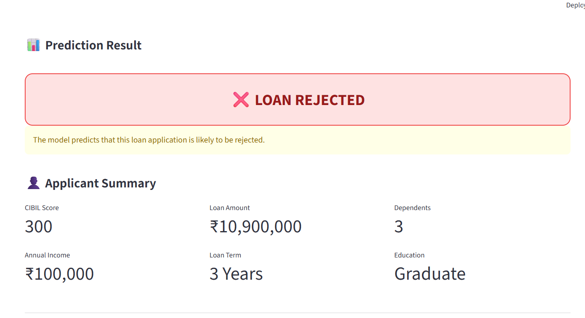

# 🏦 Loan Approval Prediction System

A machine learning project that predicts whether a loan application is likely to be **Approved** or **Rejected** based on applicant financial and demographic information.

The project includes data preprocessing, exploratory data analysis, multiple machine learning approaches, model evaluation, model serialization, and an interactive **Streamlit web application** for real-time predictions.

---

## 📌 Project Overview

Loan approval decisions depend on several factors such as income, loan amount, credit score, assets, education, employment status, and number of dependents.

This project builds a machine learning pipeline to analyze these factors and predict loan approval status.
## 🚀 Live Demo

👉 [Try the Loan Approval Prediction App](https://loanapprovalprediction-4ccr7iadxaugj5ayu9fez8.streamlit.app)
## 📸 Application Screenshots

### ✅ Loan Approved


### ❌ Loan Rejected



### 🎯 Objective

- Preprocess and clean the loan approval dataset
- Explore important patterns in the data
- Train and compare multiple machine learning models
- Handle class imbalance using **SMOTE**
- Evaluate models using standard classification metrics
- Save the trained model for deployment
- Build an interactive Streamlit application for loan prediction

---

## 🧠 Machine Learning Algorithms

The project evaluates the following approaches:

1. **Logistic Regression**
2. **Decision Tree Classifier**
3. **Logistic Regression + SMOTE**
4. **Decision Tree + SMOTE**

### ⭐ Best Performing Model

The **Decision Tree Classifier** achieved the best performance among the evaluated models.

| Model | Accuracy |
|---|---:|
| Logistic Regression | 90.52% |
| **Decision Tree** | **97.78%** |
| Logistic Regression + SMOTE | 91.22% |
| Decision Tree + SMOTE | 97.07% |

> Evaluation is based on the project's 80/20 train-test split with `random_state=42`.

---

## 📊 Dataset

**Dataset:** Loan Approval Dataset

The dataset contains **4,269 loan application records** and 13 columns.

### Features

| Feature | Description |
|---|---|
| `loan_id` | Unique loan application identifier |
| `no_of_dependents` | Number of dependents |
| `education` | Graduate / Not Graduate |
| `self_employed` | Yes / No |
| `income_annum` | Annual income |
| `loan_amount` | Requested loan amount |
| `loan_term` | Loan repayment term |
| `cibil_score` | Applicant's CIBIL/credit score |
| `residential_assets_value` | Value of residential assets |
| `commercial_assets_value` | Value of commercial assets |
| `luxury_assets_value` | Value of luxury assets |
| `bank_asset_value` | Value of bank assets |
| `loan_status` | Approved / Rejected |

---

## 🔄 Project Workflow

```text
Dataset
   │
   ▼
Data Cleaning
   │
   ▼
Categorical Encoding
   │
   ▼
Exploratory Data Analysis
   │
   ▼
Train-Test Split
   │
   ├───────────────┐
   ▼               ▼
Logistic       Decision Tree
Regression
   │               │
   └───────┬───────┘
           ▼
        SMOTE
           │
           ▼
   Additional Models
           │
           ▼
 Model Evaluation
           │
           ▼
Best Model Selection
           │
           ▼
Saved Model (.pkl)
           │
           ▼
Streamlit Web App
           │
           ▼
Loan Approval Prediction
```

---

## 🧹 Data Preprocessing

The project performs the following preprocessing steps:

- Removes unnecessary whitespace from column names
- Cleans categorical values
- Encodes categorical variables into numerical values
- Converts numerical fields into appropriate numeric types
- Checks for missing values
- Checks for duplicate records
- Separates features and target variable
- Removes `loan_id` from model input
- Splits the dataset into training and testing sets

### Categorical Encoding

```text
Education:
Graduate → 1
Not Graduate → 0

Self Employed:
Yes → 1
No → 0

Loan Status:
Approved → 1
Rejected → 0
```

---

## ⚖️ Handling Class Imbalance

The dataset contains more approved than rejected loan applications.

To investigate the effect of class balancing, **SMOTE (Synthetic Minority Over-sampling Technique)** is applied to the training data.

Two additional models are evaluated:

- Logistic Regression + SMOTE
- Decision Tree + SMOTE

This allows comparison between models trained with and without oversampling.

---

## 📈 Model Evaluation

The models are evaluated using:

- **Accuracy**
- **Precision**
- **Recall**
- **F1-Score**
- **Confusion Matrix**
- **Classification Report**

### Why F1-Score?

F1-Score combines precision and recall into a single metric and provides a useful measure when both types of classification errors matter.

---

## 🖥️ Streamlit Application

The project includes an interactive web application built with **Streamlit**.

Users can enter:

- Number of dependents
- Education
- Self-employment status
- Annual income
- Loan amount
- Loan term
- CIBIL score
- Residential asset value
- Commercial asset value
- Luxury asset value
- Bank asset value

The application then predicts:

```text
✅ LOAN APPROVED
```

or

```text
❌ LOAN REJECTED
```

The application also displays:

- Applicant summary
- Model performance
- Accuracy
- Precision
- Recall
- F1-Score
- Model comparison chart
- Confusion matrix
- Classification report

---

## 📂 Project Structure

```text
loan_project/
│
├── app.py
├── loan_prediction.py
├── loan_approval_dataset.csv
├── loan_approval_model.pkl
├── loan_features.pkl
├── requirements.txt
├── README.md
│
└── screenshots/
    └── loan_app.png
```

---

## 🛠️ Technologies Used

### Programming Language

- Python

### Libraries

- Pandas
- NumPy
- Scikit-learn
- Imbalanced-learn
- Joblib
- Matplotlib
- Seaborn
- Streamlit

### Machine Learning

- Logistic Regression
- Decision Tree
- SMOTE
- StandardScaler
- Classification Metrics

### Deployment / Interface

- Streamlit

---

## ⚙️ Installation

### 1. Clone the repository

```bash
git clone https://github.com/your-username/loan-approval-prediction.git
```

### 2. Navigate to the project folder

```bash
cd loan-approval-prediction
```

### 3. Install dependencies

```bash
pip install -r requirements.txt
```

---

## ▶️ Run the Project

### Step 1 — Train the model

Run:

```bash
python loan_prediction.py
```

This generates:

```text
loan_approval_model.pkl
loan_features.pkl
```

### Step 2 — Launch the Streamlit application

```bash
streamlit run app.py
```

The application will open in your browser.

---

## 📊 Results

The Decision Tree model performed best among the tested approaches.

### Decision Tree Performance

```text
Accuracy  ≈ 97.78%
Precision ≈ 97.8%
Recall    ≈ 97.8%
F1-Score  ≈ 97.8%
```

The exact precision, recall, and F1 values can be viewed in the Streamlit model-performance section and classification report.

---

## 🔍 Key Insights

- CIBIL score is an important input for loan approval prediction.
- Applicant income and requested loan amount are included as major financial features.
- Asset values provide additional information about the applicant's financial profile.
- Decision Tree performed better than Logistic Regression on this dataset.
- SMOTE improved the Logistic Regression accuracy but did not outperform the plain Decision Tree.
- The trained Decision Tree model is saved and used by the Streamlit application.

---

## 🚀 Future Enhancements

Possible future improvements include:

- Hyperparameter tuning
- Cross-validation
- Feature importance visualization
- Probability-based approval confidence
- SHAP-based model explainability
- Improved input validation
- Cloud deployment
- Database integration
- User authentication
- Loan risk scoring
- Automated model retraining

---

## ⚠️ Disclaimer

This project is developed for **educational and portfolio purposes**.

The prediction produced by the application should not be treated as an actual financial or banking decision.

---

## 👩‍💻 Author

**S. Priyadharshini**

MSc Data Science

Machine Learning | Data Analytics | Python | Streamlit

---

## ⭐ If you found this project useful

Feel free to **star ⭐ the repository** and explore the project.
